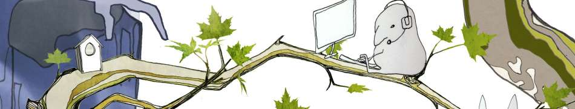
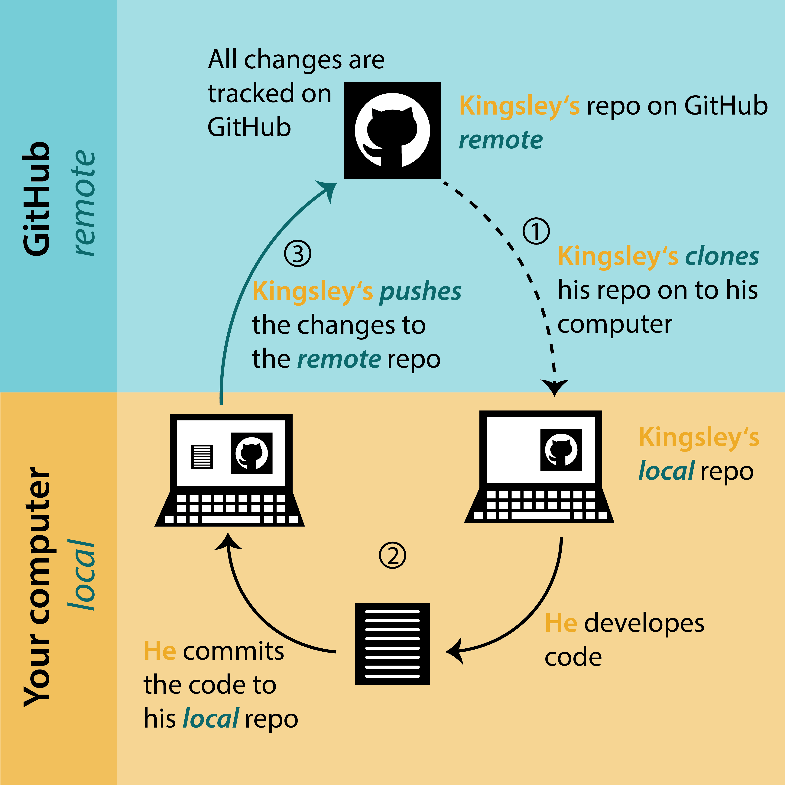
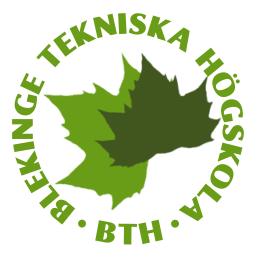

# Välkommen till BTH och introveckan för Webbprogrammering 

Detta repo används på en introduktion till Git, som hålls i introveckan. 

Bilden nedan visar flödet mellan ditt lokala Git-repo och GitHub.

<i>Källa: https://biostats-r.github.io/biostats/github/1_Git_Tutorial.html#fig-workflow</i>

## Klona ett repo

Du skapar en lokal kopia av ett repo. 

**git clone <namn på repot>**

## Lägg till en fil

Du väljer vilka filer som ska sparas.

**git add <filnamn>**

git add betyder: “Jag vill att Git ska hålla koll på den här ändringen nästa gång jag sparar en version.”
Du markerar filer (eller delar av filer) för commit.

Med git add . (lägger till alla filer i repot)

## Gör en ny version av repot

Du sparar en "version" av repot.

**git commit -m "Beskrivning av versionen."**

git commit betyder: “Spara en ny version med allt jag markerat med git add.”
Du skapar en snapshot med en loggtext som beskriver förändringen.

## Uppdatera repot på GitHub (remote)

Lärarna visar hur de uppdaterar repot remote på GitHub eftersom GitHub inte tillåter att alla uppdaterar. Du testar "git push" i nästa övning där du skapar ett eget repo.

**git push**

git push betyder: "Jag delar med mig av min lokala version till alla som använder repot på GitHub."

## Quiz

Kolla din kunskap med detta [**quiz**](quiz.md)

